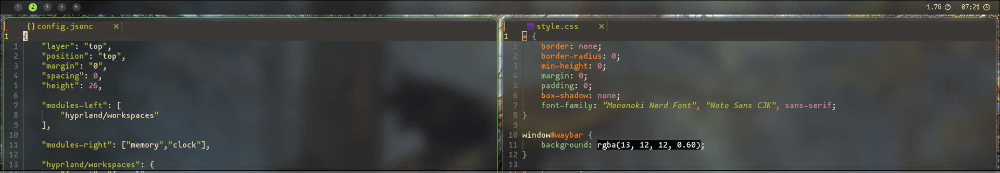

# my very minimal waybar config
i have always been anti-bar in my WM environments but  i'm giving waybar a go


Layer rule in hyprland.conf for the compositor blur:

```conf
layerrule {
  name = layerrule-1
  blur = on
  match:namespace = waybar
}
```
