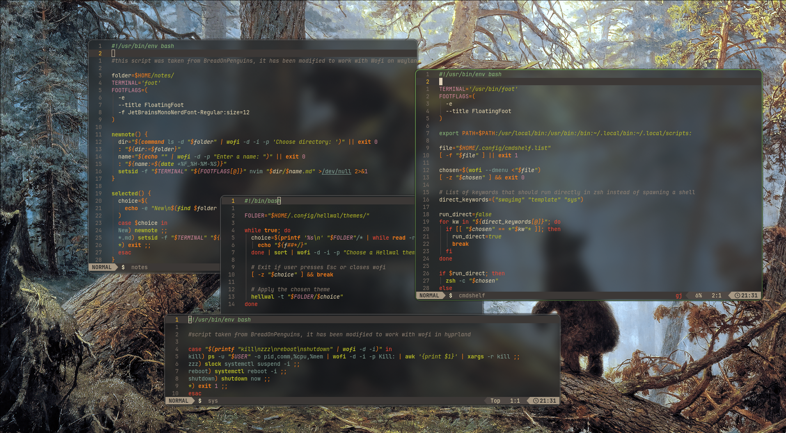
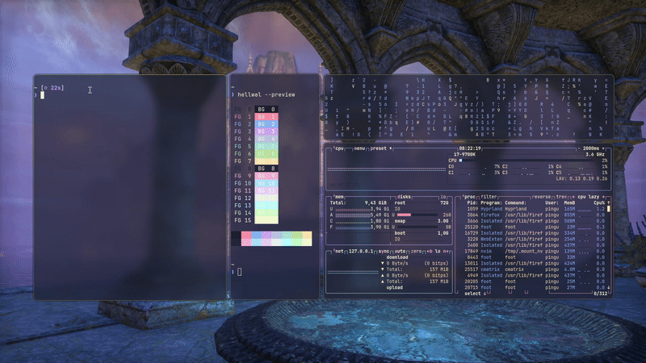
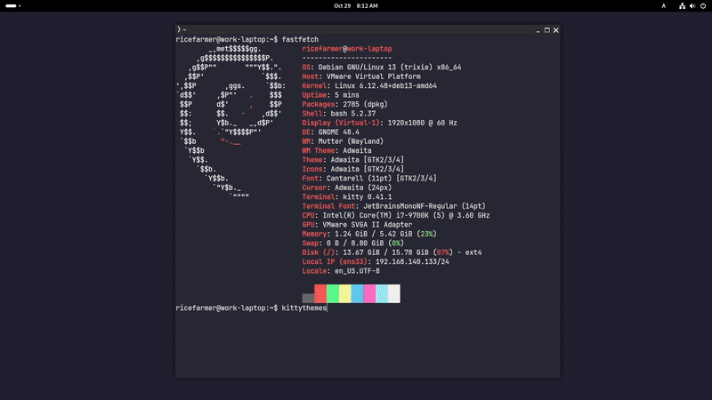

# DOTFILES

welcome to my Arch Hyprland dotfiles + tools and scripts made by me  

  
### specs

- **OS:** [Arch Linux](https://archlinux.org)
- **WM:** [Hyprland](https://hypr.land/)
- **Shell:** [Zsh](https://wiki.archlinux.org/index.php/Zsh)
- **Terminal:** [Kitty](https://wiki.archlinux.org/title/Kitty) & [Foot](https://wiki.archlinux.org/title/Foot)
- **Editor:** [Neovim](https://github.com/nvim-lua/kickstart.nvim)
- **Browser:** [Zen](https://zen-browser.app/)
- **Theme management:** [awww (wallpaper)](https://codeberg.org/LGFae/awww) / [hellwal (terminal colors)](https://github.com/danihek/hellwal)
- **Prompt customization:** [starship](https://starship.rs/) w/ [starchanger](starchanger/)
- **Image Gallery:** [swayimg](https://github.com/artemsen/swayimg)
- **GTK:** [gruvbox-gtk-theme-git](https://aur.archlinux.org/packages/gruvbox-gtk-theme-git)

## Scripts you might like

check them out [here](scripts/)

## My Tools

### Hellman

a Hellwal theme picker with a TUI

**you can check it out [here](mytools/hellman/)**

### Starchanger

a Starship preset changer with a TUI

**you can check it out [here](mytools/starchanger/)**

  

### KittyThemes

A Kitty theme picker with a TUI.  
Great for simple theme management in Kitty when not using hellwal/pywall.

**you can check it out [here](/mytools/kittythemes/)**

